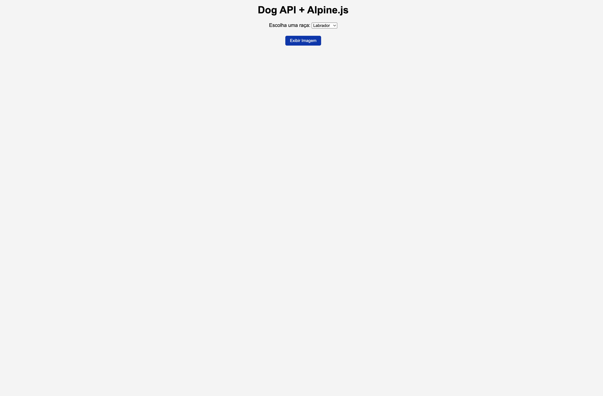
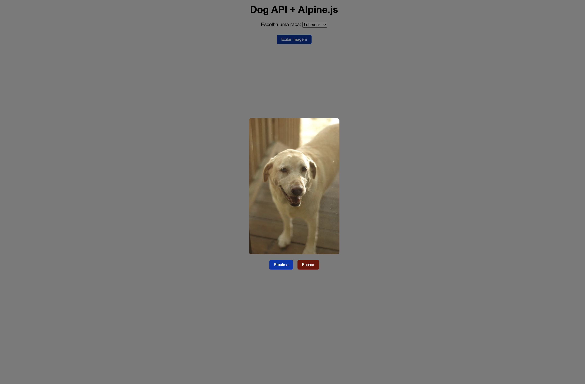

# Dog API com Alpine.js

## Sobre
Este é um projeto simples que mostra imagens de **cachorros fofos** usando a [Dog API](https://dog.ceo/dog-api/) e o [Alpine.js](https://alpinejs.dev/), realizadas no curso técnico de desenvolvimento de sistemas [SENAI JANDIRA](https://sp.senai.br/unidade/jandira/) 

Você pode:
- Escolher uma raça de cachorro 
- Buscar uma imagem aleatória dessa raça ou de qualquer raça
- Abrir e fechar um modal (janelinha) com a foto
- Pedir para carregar outro cachorro

---

## Estrutura de diretórios 

dog-api-alpine
 ┣ 📜 index.html     # Página principal
 ┣ 📜 app.js         # Código Alpine.js com lógica do dogApp
 ┣ 📜 style.css      # Estilos da página e do modal
 ┗ 📜 README.md      # Documentação 

## Uso do Alpine.js

 ┣ 📜 index.html     # Página a principal terá uma tag script que carrega o alpine.js

 Dessa forma:
 "  "

## Funções JS

1. Você clica → chama `buscarDog()`  
2. Abre modal + ativa carregando  
3. Decide se pega raça ou aleatório  
4. Faz `fetch` na Dog API  
5. Salva imagem na variável `imagem`  
6. Para de carregar → mostra o cachorro  

---

## Funções Alpine.js

1. x-data -> Cria a "caixa de dados" onde ficam as variáveis e métodos. Tudo que está dentro dela pode ser usado no HTML.
2. x-model -> Faz a ligação entre o valor do input e a variável do Alpine.
3. x-if -> Mostra ou esconde elementos condicionalmente (remove do DOM se for falso).
4. @click -> Ouve o evento de clique e executa uma ação.

---

## EXIBIÇÃO

---

## Tecnológias utlizadas
- HTML
- CSS
- JS
- Markdown
- Git
- Alpine.js

---

## Apresentação
https://www.canva.com/design/DAGwEZ6pom0/5EbraMLZ20gsJoM6nEpUkA/edit?utm_content=DAGwEZ6pom0&utm_campaign=designshare&utm_medium=link2&utm_source=sharebutton

___

## Autor
LinkedIn -> [Giovanna Coelho](https://www.linkedin.com/in/giovannacoelhogiliodesa/)

